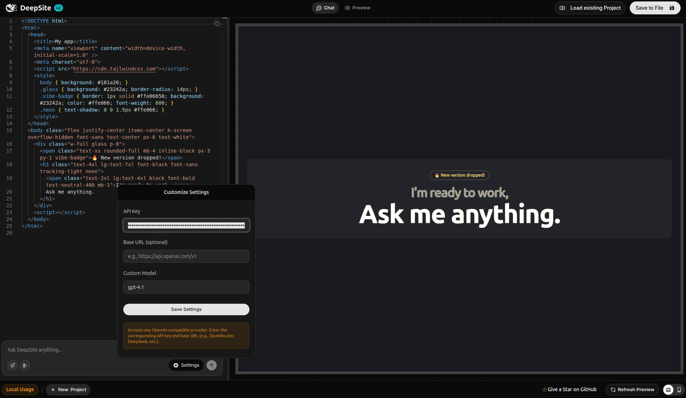

# DeepSite v2 🚀

> **Note:** If you want to access the previous version of DeepSite, check the `main-v1` branch on this repository.



Run **DeepSite** in your own environment, without relying on external services!
Perfect for those who want to customize, integrate, or have full control over the platform.

---

## How to run DeepSite v2 locally

### 1. Clone the repository
```bash
git clone https://github.com/MartinsMessias/deepsite-locally.git
cd deepsite-locally
```

### 2. Install dependencies
Make sure you have **Node.js** installed (recommended v18+).
```bash
npm install
```

### 3. Run in development mode
```bash
npm run dev
```

### 4. For build and production
```bash
npm run build
npm run start
```

---

## Available scripts

- `npm run dev` — Starts the development environment (Next.js + Turbopack)
- `npm run build` — Builds for production
- `npm run start` — Runs the server in production mode
- `npm run lint` — Runs the linter

## Main dependencies

Next.js, React 19, Mongoose, TailwindCSS, Radix UI, Lucide, Monaco Editor, React Query, Zod, Axios, Sonner, and more.

See all dependencies in [`package.json`](./package.json).

---

## Keywords
deepsite local hosting, deepsite run locally, deepsite self-hosted, how to run deepsite locally, install deepsite on your machine, deepsite local server setup, deepsite offline mode, deepsite localhost tutorial, deploy deepsite on your own server, deepsite self-install guide, how to host deepsite on localhost step-by-step, can deepsite run offline on my computer, deepsite docker installation guide, full guide to running deepsite locally without internet, deepsite self-host vs cloud hosting comparison, deepsite performance tips when running locally, requirements to run deepsite on local environment, best practices for self-hosting deepsite platform, how to speed up deepsite in a local environment, common errors when running deepsite locally and how to fix, deepsite vs other ai site builders local run comparison, top reasons to run deepsite on your own server, is deepsite open-source and local-friendly

